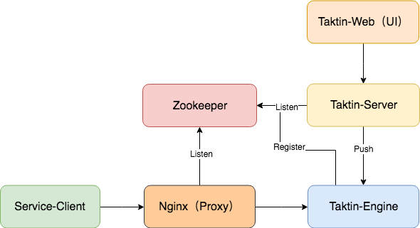

# taktin

A light weight and high performance traffic management platform based on OpenResty.



## Features

```md
核心是提供自定义、精细化的流量控制能力。
独立的流量管理服务。
基于 OpenResty 框架带来的 高并发、高性能。
```

## Application Scenarios

```md
A/B Test
灰度发布
动态配置
```

## Technology stack

* taktin-engine

> * [OVP](https://github.com/SunnnyChan/OVP)

* taktin-server

> * [restful-web](https://github.com/SunnnyChan/restful-web)

* taktin-web （UI）

* zookeeper

```text
Service register and discovery.
```

## Deploy

***Deploy taktin-engine***

***Deploy taktin-server***

***Execute SQL***

## [Doc.](_doc/README.md)